# 📊 Analiza wyników

## Zbiory danych

Zbiór danych składa się z plików muzycznych z czterech źródeł: zbiorów danych [Gtzan](https://www.kaggle.com/datasets/andradaolteanu/gtzan-dataset-music-genre-classification), [Maestro](https://magenta.tensorflow.org/datasets/maestro), [Groove](https://magenta.tensorflow.org/datasets/groove) oraz [MusicNet](https://www.kaggle.com/datasets/imsparsh/musicnet-dataset).

- ### Gtzan
    Zbiór danych składający się z piosenek z 10 gatunków muzycznych, po 100 próbek na każdy gatunek, o długości 30 sekund każdy. Zbiór składający się z utwór w formacie .wav został przetworzony z postaci plików .midi za pomocą funkcji biblioteki Librosa.

    Przetworzenie z pliku .wav do pliku .midi skupiało się na wyodrębnieniu nut za pomocą częstotliwości, wyszukiwaniu pików częstotliwości oraz na mapowaniu częstotliwości na nuty MIDI. Przy mapowaniu pomijano fragmenty z ciszą. W rezultacie powstałe pliki MIDI utraciły znaczną część jakości i nie są odpowiednikami plików .wav. Mogło mieć to wpływ na rezultaty badań dotyczących piosenek z tego zbioru danych.

    Przy konwersji wykorzystano funkcje tj. onset.onset_strength, beat.beat_track oraz piptrack.

- ### Maestro
    Zbiór danych składający się z utworów pianina. Zawiera pliki w reprezentacji zarówno .wav jak i .midi. Ze zbioru wylosowano 100 utworów .wav oraz odpowiadających im plików .midi, następnie każdy z plików przycięto do długości 3 sekund. Z tego zbioru pochodza dane badania dla instrumentu pianina.

- ### Groove
    Zbiór danych składający się z utworów perkusji. Zawiera pliki w reprezentacji zarówno .wav jak i .midi. Ze zbioru wylosowano 100 utworów .wav oraz odpowiadających im plików .midi, następnie każdy z plików przycięto do długości 3 sekund. Z tego zbioru pochodzą dane do badania dla instrumentu perkusji.

- ### MusicNet
    Zbiór danych wykonań muzyki klasycznej w postaci .wav oraz .midi. Ze względu na cel w postaci ekstrakcji instrumentów, wykorzystano z tego zbioru jedynie pliki .midi. Wyszukiwano pliki .midi odpowiadające wykonaniom, do których wykorzystano instrumenty, które były zainteresowaniem.

    Przykładowo aby uzyskać pliki zawierające grę harfy, wyszukane zostały utwory zawierające taki instrument:
    - Violin Sonata in B minor 1. Adagio Violin and *Harpsichord* Paul Pitman
    - Violin Sonata in B minor 2. Allegro Violin and *Harpsichord* Paul Pitman
    - Violin Sonata in B minor 3. Andante Violin and *Harpsichord* Paul Pitman
    - Violin Sonata in B minor 4. Allegro Violin and *Harpsichord* Paul Pitman

    Następnie dokonywano ekstrakcji poszczególnych kanałów pliku .midi. Dla podanego przypadku, na jednym kanale znajdowała się gra skrzypiec, a na drugim gra harfy. Następnie z pliku .midi z kanałem gry wyłącznie harfy generowano plik .wav, a po tym oba pliki przycinano do długości 3 sekund. Wynikowe pliki wchodziły w skład zbioru danych odpowiedniego instrumentu, w tym przypadku harfy.

    Stosując takie zasady wygenerowano zbiory danych do celów badania dla instrumentów: fagotu, wiolonczeli, klarnetu, kontrabasu, elektrycznej gitary, fletu, harfy oraz skrzypiec.

## Testy

- ### Gtzan
    - #### Redukcja wymiarów embeddingów i wizualizacja (PCA, TSNE), wyliczenie centroidów
        

        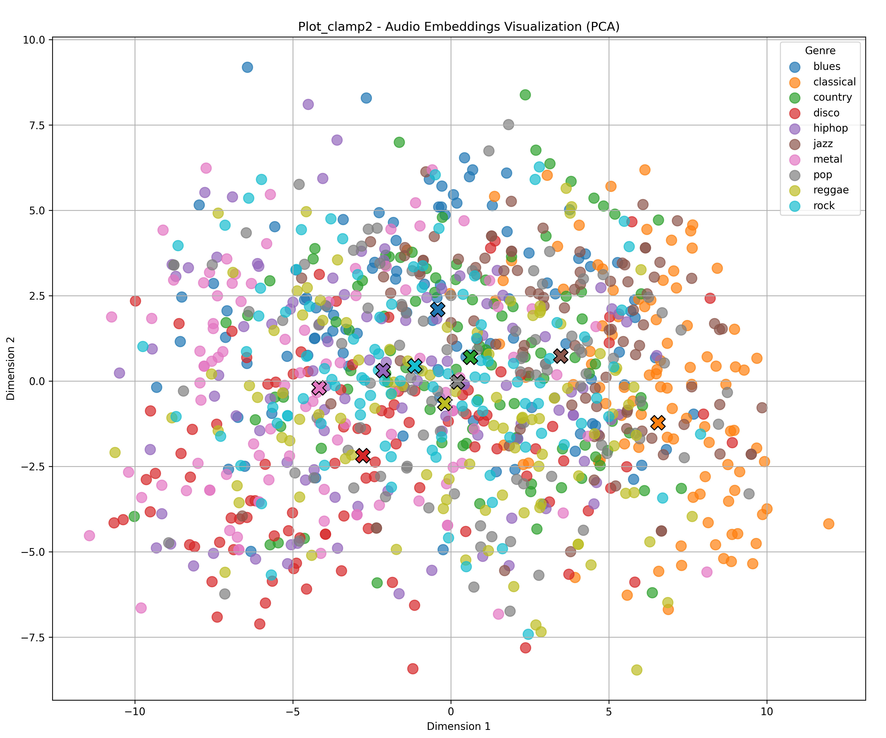
        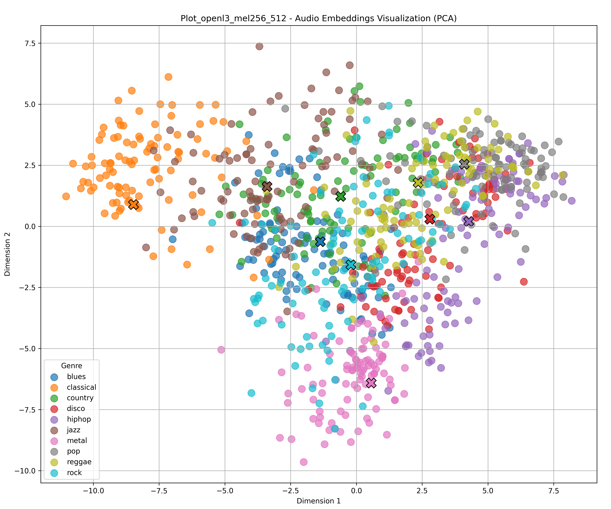
        

        

        <b>Rysunek 1:</b> Redukcja wymiarów PCA (Lewy: CLAMP2, Prawy: OpenL3 [512] )
        

        
        

        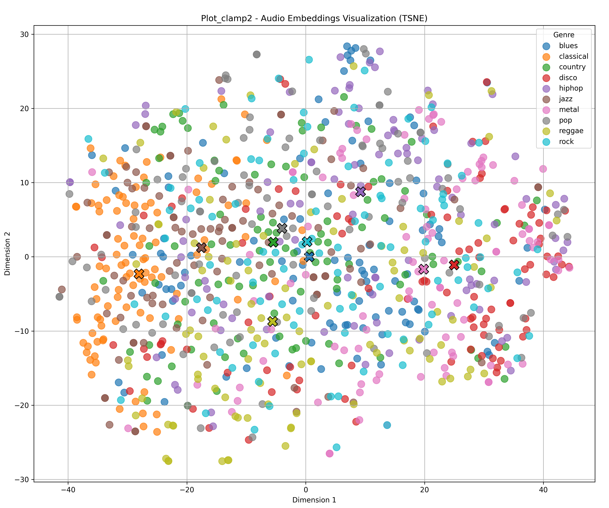
        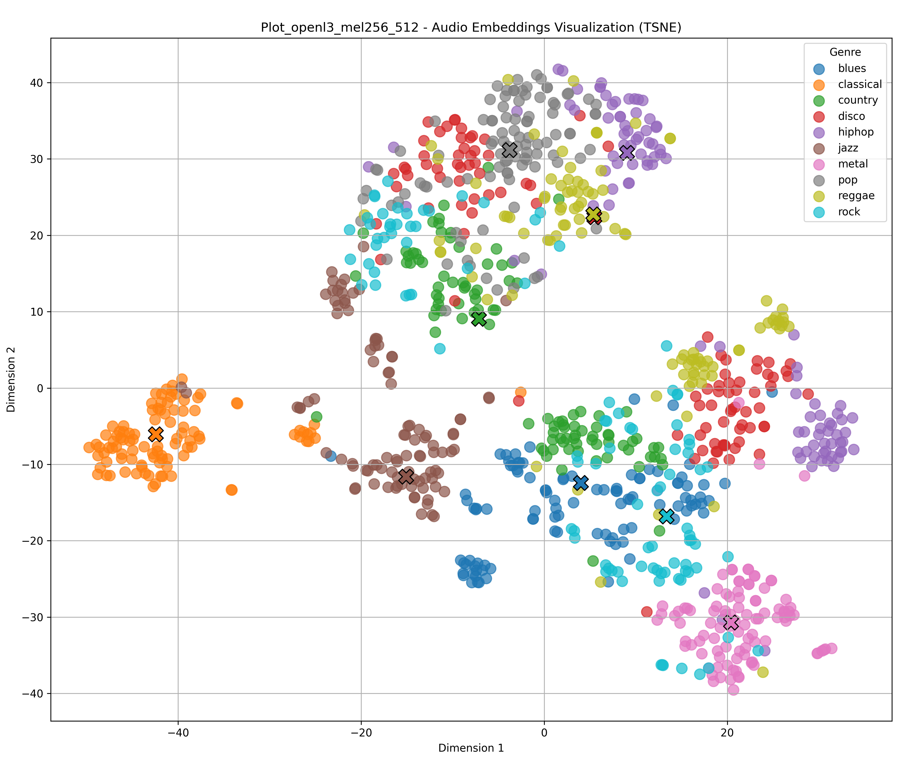
        

        

        <b>Rysunek 2:</b> Redukcja wymiarów TSNE (Lewy: CLAMP2, Prawy: OpenL3 [512] )
        

    - #### Miary cosinusowe (znormalizowane różnice)

        

        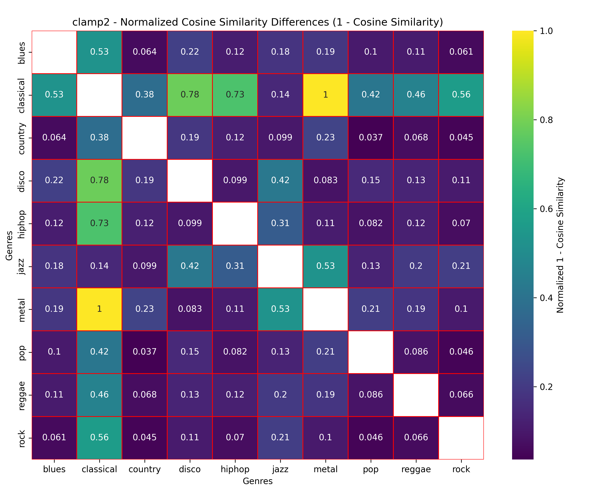
        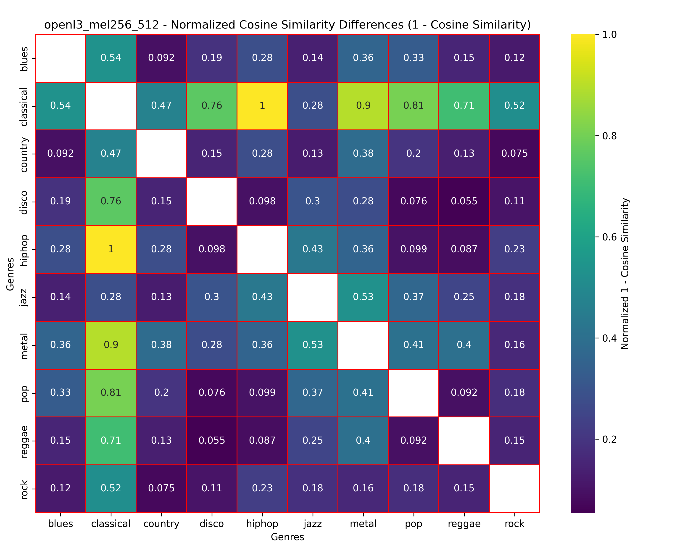
        

        

        <b>Rysunek 3:</b> Analiza podobieństwa kosinusowego (Lewy: CLAMP2, Prawy: OpenL3 [512] )
        

    - #### Średnia wariancja embeddingów w kategorii      
        - **Tabela 1:** ClaMP2
            | Gatunek      | Blues  | Classical | Country | Disco  | HipHop | Jazz  | Metal | Pop   | Reggae | Rock  |
            |------------|--------|-----------|---------|--------|---------|-------|-------|-------|--------|-------|
            |Średnia wariancja | 0.140  | 0.126     | 0.117   | 0.137  | 0.154   | 0.117 | 0.143 | 0.134 | 0.152  | 0.130 |
         - **Tabela 2:** OpenL3 [512]
            | Gatunek         | Blues  | Classical | Country | Disco  | HipHop | Jazz  | Metal | Pop   | Reggae | Rock  |
            |--------------|--------|-----------|---------|--------|---------|-------|-------|-------|--------|-------|
            |Średnia wariancja| 0.076  | 0.086     | 0.068   | 0.075  | 0.073   | 0.096 | 0.056 | 0.055 | 0.083  | 0.084 |
    - #### Czas generacji embeddingów
        - **Tabela 3:**
            | Metoda                            | Czas     |
            |-------------------------          |----------|
            | Open L3 (mel 256 emb_size 6144)   | 0:26:39  |
            | Open L3 (mel 256 emb_size 512 )   | 0:26:50  |
            | Clamp 2                           | 0:03:01  |

- ### Instrumenty
    - #### Redukcja wymiarów embeddingów i wizualizacja (PCA, TSNE), wyliczenie centroidów
        

        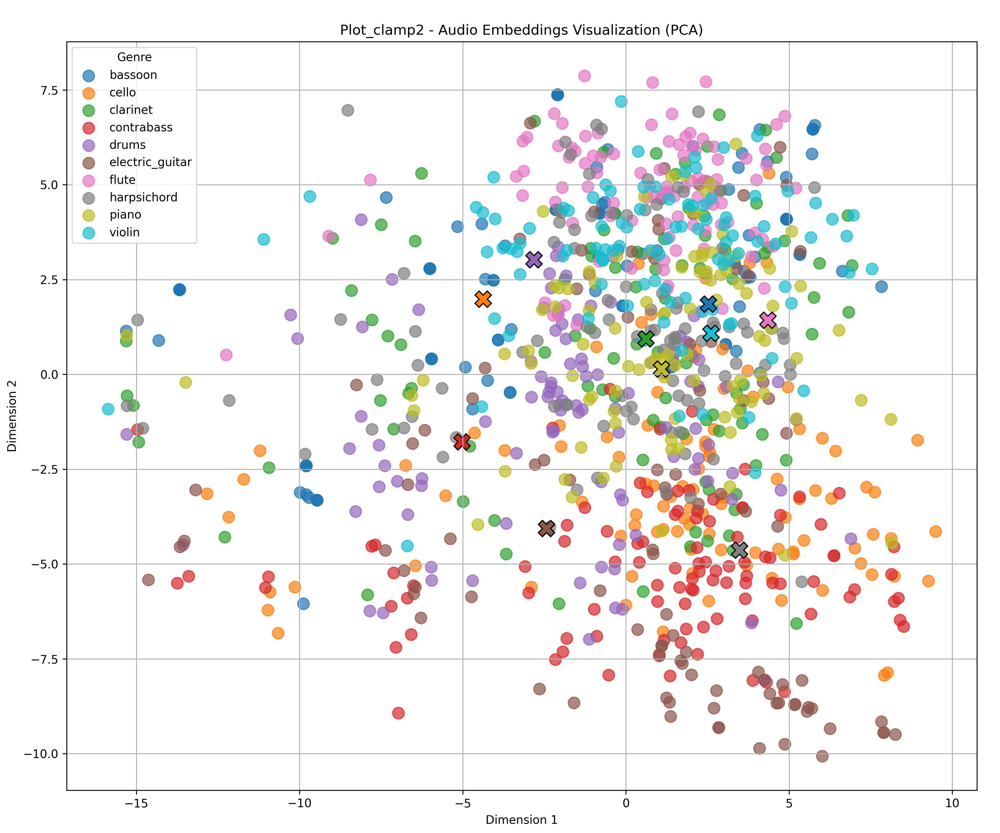
        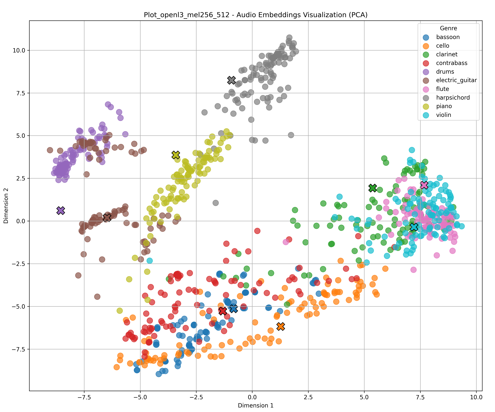
        

        

        <b>Rysunek 4:</b> Redukcja wymiarów PCA (Lewy: CLAMP2, Prawy: OpenL3 [512] )
        

        
        

        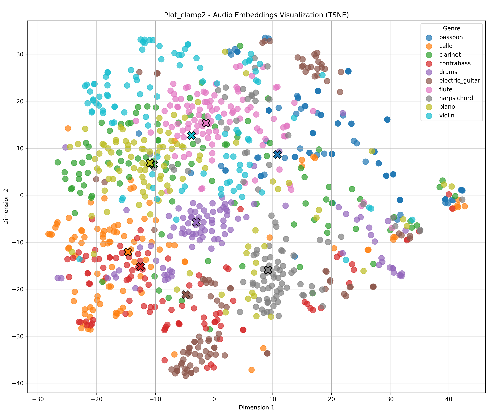
        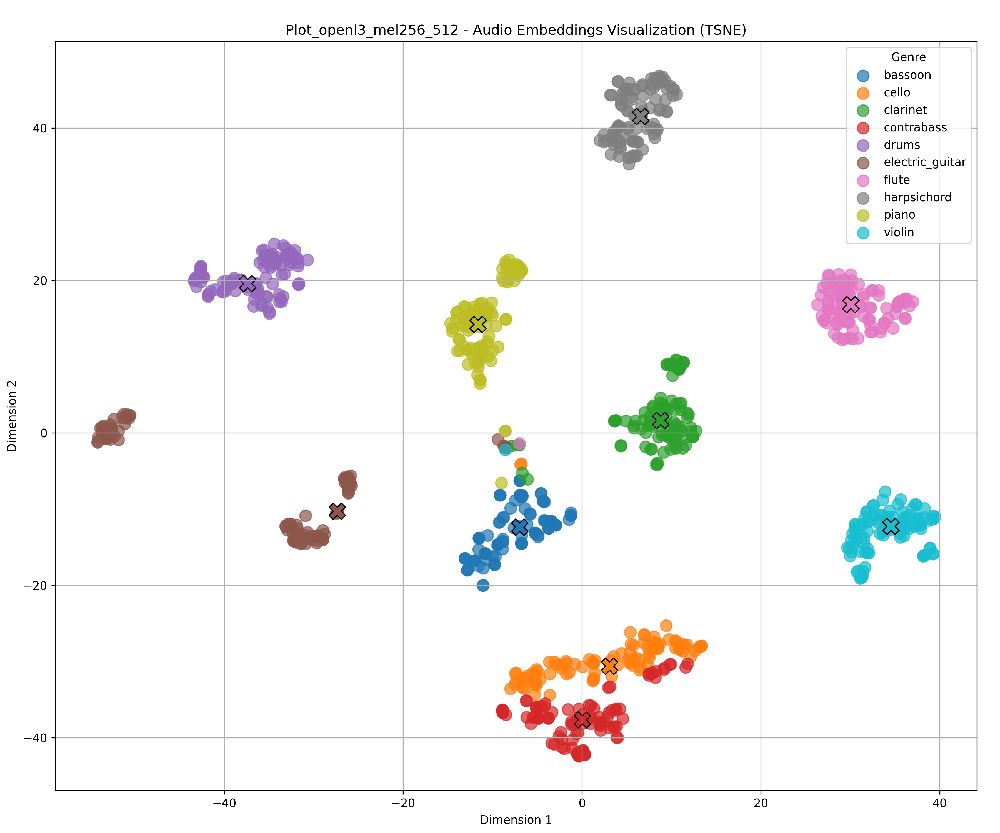
        

        

        <b>Rysunek 5:</b> Redukcja wymiarów TSNE (Lewy: CLAMP2, Prawy: OpenL3 [512] )
        

    - #### Miary cosinusowe (znormalizowane różnice)

        

        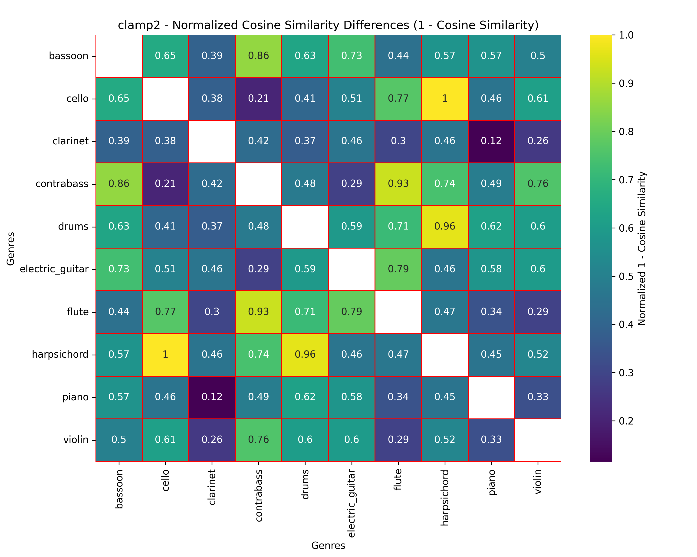
        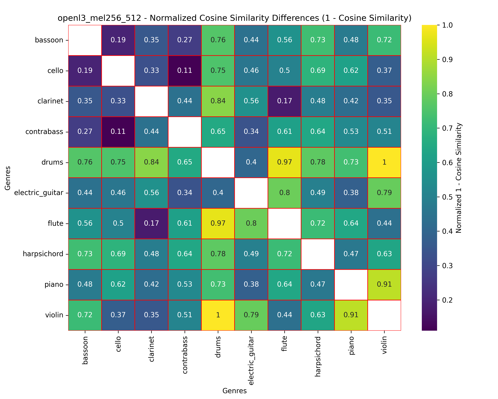
        

        

        <b>Rysunek 6:</b> Analiza podobieństwa kosinusowego (Lewy: CLAMP2, Prawy: OpenL3 [512] )
        

    - #### Średnia wariancja embeddingów w kategorii
        - **Tabela 4:** ClaMP2
            | Instrument      | Bassoon | Cello | Clarinet | Contrabass | Drums | Electric Guitar | Flute | Harpsichord | Piano | Violin |
            |--------------|--------|-------|----------|------------|-------|----------------|-------|------------|-------|--------|
            |Średnia wariancja| 0.216  | 0.219 | 0.214    | 0.217      | 0.203 | 0.225          | 0.158 | 0.184      | 0.191 | 0.224  |
         - **Tabela 5:** OpenL3 [512]
            | Instrument      | Bassoon | Cello | Clarinet | Contrabass | Drums | Electric Guitar | Flute | Harpsichord | Piano | Violin |
            |--------------|--------|-------|----------|------------|-------|----------------|-------|------------|-------|--------|
            |Średnia wariancja| 0.076  | 0.119 | 0.102    | 0.079      | 0.058 | 0.221          | 0.038 | 0.060      | 0.055 | 0.068  |

    - #### Czas generacji embeddingów**
        - **Tabela 6:**

            | Metoda                               | Czas    |
            |-------------------------             |----------|
            | Open L3 (mel 256 emb_size 6144 )     | 00:03:15 |
            | Open L3 (mel 256 emb_size 512 )      | 0:03:05  |
            | Clamp 2                              | 00:02:27 |

## Wnioski

Na wykresach wizualizujących zagnieżdżenia po redukcji ich wymiarowości przez algorytmy PCA oraz TSNE można zauważyć, że embeddingi muzyki w formacie audio generowane przez OpenL3 klastrują się lepiej, niż emeddingi muzyki symbolicznej CLaMP2. Oba modele radzą sobie z rozróżnianiem zarówno gatunków muzyki 
(rys. [1, 2](#gtzan-redukcja)), jak i instrumentów (rys. [4, 5](#instr-redukcja)), co widać na wizualizacjach w przestrzenii zredukowanej.
  Takie same wnioski można wysunąć analizując tabele (rys. [3](#gtzan-cos), [6](#instr-cos)). Zmierzone zostały odległości cosinusowe między centroidami (uśrednionymi wartościami embeddingów) dla danej kategorii, a następnie znormalizowane. Im większe wartości tym większe różnice pomiędzy badanymi kategoriami. Na rysunku [3](#gtzan-cos) widzimy, że największe wartości osiąga dla obydwu modeli muzyka klasyczna, a więc zarówno embeddingi plików symbolicznych jak i audio najbardziej rozróżniają ten gatunek muzyki od innych badanych.
 Przewagę OpenL3 widać również w tabelach z wartościami uśrednionej wariancji embeddingów danych gatunków muzycznych oraz instrumentów (tab. [1, 2](#gtzan-var), [4, 5](#instr-var)), gdzie ten model generuje bardziej spójne embeddingi w ramach badanych kategorii.

Na podstawie testów przeprowadzonych na omówionych wcześniej zbiorów danych, nasuwa się wniosek, że embeddingi treści muzycznych w formacie audio są wyższej jakości od embeddingów tych samych treści w formacie symbolicznym.  

Należy jednak wspomnieć o istotnych aspektach, które mogą wpłynąć na ostateczną ocenę i wybór danej metody. Największą zaletą CLaMP2 jest jego szybkość działania. Dla zbioru piosenek, czas generacji tego modelu osiągał niemal 10 razy mniejsze wartości od OpenL3 (tab. [3](#gtzan-time)). Co ciekawe Clamp2 dla zbioru instrumentów generował zagnieżdżenia tylko o niecałe 20% szybciej, gdzie OpenL3 był ok. 90% szybszy. Widać więc, że OpenL3 jest znacznie bardziej podatny na długość badanych fragmentów audio (instrumenty miały 10-krotnie krótsze audio od piosenek). Ma to również swoje odzwierciedlenie w wielkościach plików w formatach symbolicznych i audio. Przykładowy plik muzyki z gatunku blues waży w formacie .mid 545B, natomiast plik z tym samym fragmentem piosenki w formacie .wav waży 1.26MB. Różnica jest więc rzędu tysięcy, co może mieć fundamentalne znaczenie przy wyborze jednej z dwóch badanych metod do własnych zastosowań.

Ze względu na to, że dostępne zbiory danych rzadko zawierają pliki w obu formatach, pliki midi w dużej części były generowane z plików audio, co mogło obniżać ich jakoś przez co embeddingi muzyki symbolicznej wypadałby nieco gorzej. Jednak mimo wszystko w badanych testach nadal zauważalne było generowanie jakościowych embeddingów przez model CLaMP2. 

Podsumowując embeddingi muzyki z badanych zbiorów są lepszej jakości dla danych w formacie audio. Generacja zagnieżdżeń w formacie symbolicznym jest natomiast znacznie szybsza, a jej dokładność może wystarczyć do wielu zastosowań. Różnica w prędkości pomiędzy dwoma rodzajami embeddingów rośnie wykładniczo wraz z długością audio. Dodatkowo, ważnym aspektem przy projektowaniu rozwiązań wykorzystujących badane technologie jest to, że pliki w formacie symbolicznym ważą zdecydowanie mniej, jednak są ciężej dostępne przez co trzeba je samemu generować co może powodować obniżenie ich jakości.  

